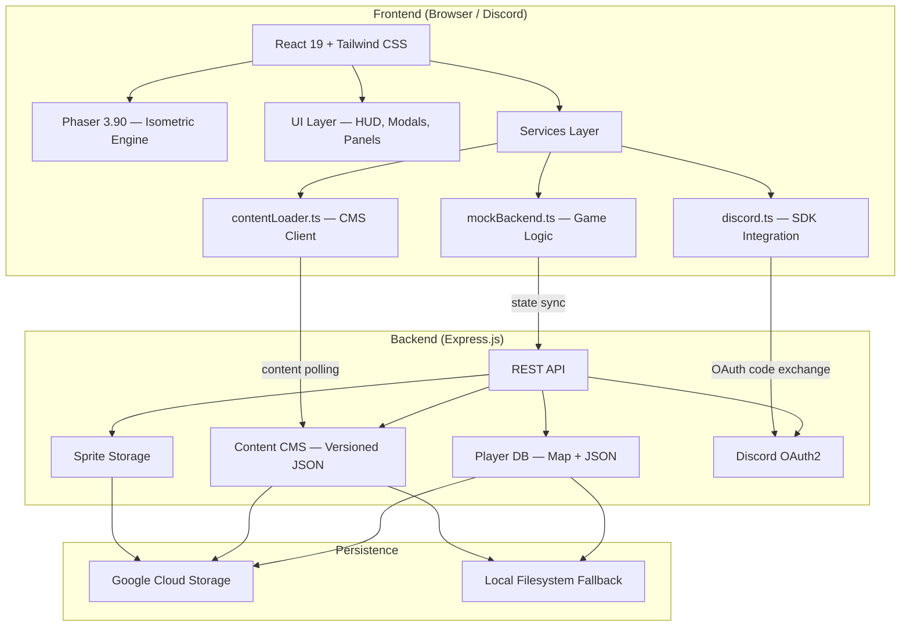
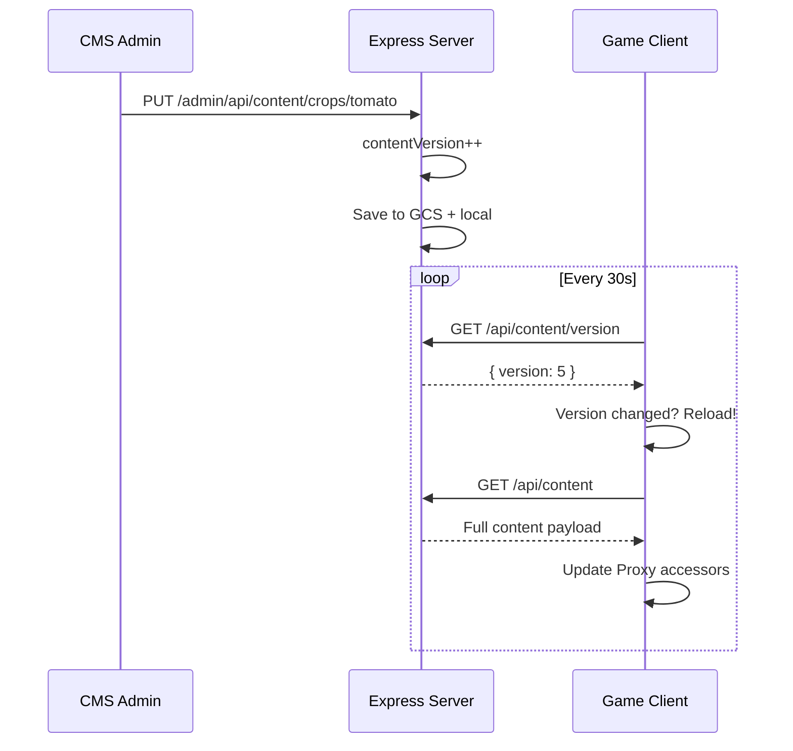

# 🥚 Egg Farm — Discord Embedded Activity

> An isometric social farming & home decoration game built as a **Discord Embedded App Activity**. Players grow crops, hatch pets from eggs, decorate rooms, visit friends, and complete quests — all inside Discord.

---

## 📸 Overview

| Feature              | Description                                                                    |
| -------------------- | ------------------------------------------------------------------------------ |
| 🏠 **Room System**   | Interior house + outdoor garden, switchable in real-time                       |
| 🌱 **Farming**       | Plant seeds, grow crops, harvest for coins & XP                                |
| 🥚 **Pet Hatching**  | Incubate eggs → weighted random pet drops with rarity tiers                    |
| 🐾 **Pet Abilities** | Equipped pets grant multiple stacking bonuses (growth speed, coin/XP rewards)  |
| 🏆 **Quest System**  | Progressive quests with conditions, level gates, and rich rewards              |
| 🛒 **Shop**          | Coins & gems economy with furniture, planters, consumables                     |
| 👥 **Social**        | Visit neighbor farms, water their plants                                       |
| 🎨 **CMS**           | Admin dashboard for live content editing (items, crops, pets, quests, sprites) |

---

## 🏗 Architecture



---

## 📁 Project Structure

```
egg-farm/
├── server.js                 # Express backend — API, CMS, auth, storage
├── App.tsx                   # React root — state orchestrator (558 lines)
├── index.tsx                 # React DOM entry point
├── index.html                # SPA shell with ESM importmap
├── types.ts                  # 15 TypeScript interfaces (UserState, configs, etc.)
├── constants.ts              # Proxy-based hot-reloading content accessors
├── style.css                 # Tailwind directives + custom animations
│
├── game/
│   └── scenes/
│       └── MainScene.ts      # Phaser isometric renderer (634 lines)
│
├── components/
│   ├── GameCanvas.tsx         # Phaser ↔ React bridge
│   └── ui/
│       ├── HUD.tsx            # Heads-up display (level, XP bar, currency, sidebar)
│       ├── ShopModal.tsx      # Shop with tabs (items, seeds, eggs, gems)
│       ├── PetsModal.tsx      # Pet list, equip/unequip
│       ├── QuestsPanel.tsx    # Quest tracker with progress bars
│       ├── EditorBar.tsx      # Edit-mode toolbar (place, rotate, pick up)
│       ├── SeedBagModal.tsx   # Seed selection for planters
│       ├── NeighborsPanel.tsx # Social panel (visit friends)
│       ├── TutorialOverlay.tsx# Step-by-step onboarding
│       └── ConfirmationModal.tsx # IAP confirmation dialog
│
├── services/
│   ├── mockBackend.ts         # Client-side game logic (520 lines, 15 actions)
│   ├── contentLoader.ts       # API content fetcher + localStorage cache + polling
│   └── discord.ts             # Discord SDK wrapper (auth, activity, mock mode)
│
├── data/
│   └── content/               # Seed data (CMS-managed)
│       ├── items.json         # 9 items (furniture, planters, consumables, eggs)
│       ├── crops.json         # 4 crops (strawberry → golden flower)
│       ├── pets.json          # 3 pets with ability bonuses
│       ├── eggs.json          # Egg pools with weighted drop rates
│       ├── quests.json        # 5 quests (plant, harvest, buy)
│       ├── levels.json        # 5 level tiers with XP thresholds
│       ├── tutorial.json      # 5-step onboarding sequence
│       └── skus.json          # 3 gem packs (IAP)
│
├── admin/
│   └── index.html             # CMS dashboard (750+ lines vanilla JS)
│
├── Dockerfile                 # Multi-stage build (Alpine Node 20)
├── vite.config.ts             # Vite 7 + React plugin
├── tailwind.config.js         # Tailwind 3 configuration
├── package.json               # Dependencies & scripts
└── .env.example               # Environment variable reference
```

---

## ⚙️ Tech Stack

| Layer           | Technology               | Version     |
| --------------- | ------------------------ | ----------- |
| **Runtime**     | Node.js                  | 20 (Alpine) |
| **Frontend**    | React                    | 19.0        |
| **Game Engine** | Phaser                   | 3.90        |
| **Bundler**     | Vite                     | 7.3         |
| **Styling**     | Tailwind CSS             | 3.4         |
| **Icons**       | Lucide React             | 0.563       |
| **Backend**     | Express.js               | 4.18        |
| **Storage**     | Google Cloud Storage     | 7.x         |
| **Auth**        | Discord Embedded App SDK | 1.0         |
| **Language**    | TypeScript               | 5.5         |
| **Container**   | Docker                   | Multi-stage |
| **Deployment**  | Google Cloud Run         | —           |

---

## 🔌 API Reference

### Public Endpoints

| Method | Path                   | Description                                     |
| ------ | ---------------------- | ----------------------------------------------- |
| `GET`  | `/api/health`          | Health check (status, user count, GCS flag)     |
| `GET`  | `/api/content`         | All game content (items, crops, pets, etc.)     |
| `GET`  | `/api/content/version` | Content version number (for cache invalidation) |
| `GET`  | `/api/content/:type`   | Specific content type                           |
| `GET`  | `/api/state/:userId`   | Public read-only player state (for visiting)    |

### Authenticated Endpoints (Discord OAuth2)

| Method | Path             | Description                                  |
| ------ | ---------------- | -------------------------------------------- |
| `POST` | `/api/token`     | Exchange Discord OAuth code for access token |
| `GET`  | `/api/state`     | Get authenticated user's state               |
| `POST` | `/api/state`     | Save authenticated user's state              |
| `GET`  | `/api/neighbors` | Random 5 neighbors for social panel          |

### Admin Endpoints (Password-protected)

| Method   | Path                           | Description                          |
| -------- | ------------------------------ | ------------------------------------ |
| `GET`    | `/admin`                       | CMS dashboard                        |
| `GET`    | `/admin/api/content`           | Read all content                     |
| `PUT`    | `/admin/api/content/:type`     | Replace entire content type (arrays) |
| `PUT`    | `/admin/api/content/:type/:id` | Upsert single record                 |
| `DELETE` | `/admin/api/content/:type/:id` | Delete single record                 |
| `POST`   | `/admin/api/reload`            | Reload content from disk/GCS         |
| `GET`    | `/admin/api/sprites`           | List uploaded sprites                |
| `POST`   | `/admin/api/sprites`           | Upload sprite (base64)               |
| `DELETE` | `/admin/api/sprites/:name`     | Delete sprite + cascade cleanup      |
| `GET`    | `/sprites/:filename`           | Serve sprite (GCS → local fallback)  |

---

## 🧠 Core Systems

### Game Logic (`mockBackend.ts`)

Client-side game engine running 15 game actions with optimistic state updates:

```
buyItem → placeItem → plantSeed → harvestOrPickup → useConsumable
placeEgg → equipPet → switchRoom → visitNeighbor → waterNeighborPlant
buyPremiumCurrency → triggerTutorial → checkQuests → checkLevelUp
```

- **Optimistic updates**: State mutated locally, then debounced-saved to server (3s delay)
- **Pet bonuses**: `getEquippedPetBonus()` sums `bonuses[]` array (multi-ability), falls back to legacy single `bonus`
- **SKU rewards**: `buyPremiumCurrency()` grants coins, gems, and items from `rewards` object
- **Quest tracking**: `checkQuests()` fires on `PLANT_SEED`, `HARVEST`, `BUY_ITEM`
- **Fertilizer guard**: Prevents waste on fully-grown crops
- **Weighted hatching**: `weightedRandom()` for egg → pet pool selection

### Isometric Renderer (`MainScene.ts`)

634-line Phaser scene with procedural graphics:

- **Coordinate system**: `getScreenFromIso()` / `getIsoFromScreen()` — standard 2:1 isometric projection
- **Z-sorting**: Painter's algorithm based on `gridY + gridX` for correct overlap
- **Entity types**: Items (7 subtypes), Player avatar, Pet follower
- **Visual effects**: Crop growth animation, egg incubation progress bar, harvest sparkle, tutorial hints
- **Ghost placement**: Translucent preview item follows cursor during edit mode

### Content Hot-Reloading



### Data Persistence

```
Write Path: State → MockBackend → debounce(3s) → POST /api/state → Server → GCS + local
Read Path:  Server start → GCS db.json → fallback local db.json → Map<userId, state>
Shutdown:   SIGTERM/SIGINT → immediate saveDb() → GCS + local
```

---

## 🎮 Gameplay Features

### 🌱 Farming System

- Buy seeds from shop → plant in planters → wait for growth → harvest for coins + XP
- **4 crops** with increasing difficulty: Strawberry (10s, Lv1) → Golden Flower (120s, Lv5)
- **Pet growth bonus** reduces effective growth time
- **Fertilizer** (consumable) instantly completes growth

### 🥚 Pet Hatching

- Buy eggs → place in incubators → wait for hatch timer → random pet from pool
- **Progress bar** with time remaining and sparkle effect when ready
- **Weighted rarity**: Common 80% / Rare 15% / Legendary 5%
- Pets provide passive bonuses when equipped

### 🏆 Quest System

- **Conditions**: `PLANT_SEED`, `HARVEST`, `BUY_ITEM` with target counts and optional `targetId` for specific entities
- **Level gates**: `minLevel` / `maxLevel` requirements
- **Rewards**: Coins, gems, XP, items
- **Non-repeatable** quests prevent re-completion

### 🏠 Room System

- **Interior**: House decoration, furniture placement, incubators
- **Garden**: Outdoor farming, crop planters, fences
- Unlocked at Lv2 with seamless switching
- Room buttons respect visiting state — switches neighbor's room locally when visiting

---

## 🚀 Quick Start

### Prerequisites

- Node.js ≥ 20
- Discord application with Embedded App Activity enabled
- (Optional) Google Cloud project with Storage bucket

### Local Development

```bash
# 1. Clone & install
git clone <repo-url>
cd egg-farm
npm install

# 2. Configure environment
cp .env.example .env
# Edit .env with your Discord credentials

# 3. Build frontend
npm run build

# 4. Start server
npm start
# → http://localhost:8080 (game)
# → http://localhost:8080/admin (CMS)
```

### Environment Variables

| Variable                | Required | Description                       |
| ----------------------- | -------- | --------------------------------- |
| `DISCORD_CLIENT_ID`     | ✅       | Discord app client ID             |
| `DISCORD_CLIENT_SECRET` | ✅       | Discord app client secret         |
| `DISCORD_REDIRECT_URI`  | ✅       | OAuth2 redirect URI               |
| `PORT`                  | ❌       | Server port (default: `8080`)     |
| `ADMIN_PASSWORD`        | ✅       | CMS admin panel password          |
| `GCS_BUCKET`            | ❌       | GCS bucket for persistent storage |
| `GEMINI_API_KEY`        | ❌       | Optional AI features key          |

---

## 🐳 Docker Deployment

```dockerfile
# Multi-stage build
FROM node:20-alpine AS builder    # Build frontend with Vite
FROM node:20-alpine               # Production server with Express
```

```bash
# Build & run
docker build -t egg-farm .
docker run -p 8080:8080 \
  -e DISCORD_CLIENT_ID=... \
  -e DISCORD_CLIENT_SECRET=... \
  -e ADMIN_PASSWORD=... \
  egg-farm
```

### Google Cloud Run

```bash
# Deploy with gcloud
gcloud run deploy egg-farm \
  --source . \
  --region us-central1 \
  --allow-unauthenticated \
  --set-env-vars "DISCORD_CLIENT_ID=...,ADMIN_PASSWORD=..."
```

> **Note:** Set `GCS_BUCKET` for data persistence across Cloud Run deployments.  
> Without it, player data is ephemeral (lost on container restart).

---

## 🔒 Security

| Layer          | Mechanism                                                 |
| -------------- | --------------------------------------------------------- |
| Player API     | Discord OAuth2 bearer token verification                  |
| Admin CMS      | Password-based `Authorization: Bearer <password>`         |
| Sprite uploads | Filename sanitization (`[^a-zA-Z0-9._-]` → `_`)           |
| State writes   | User ID mismatch check prevents cross-user writes         |
| Public read    | `/api/state/:userId` is intentionally public for visiting |

---

## 📊 CMS Admin Panel

Access at `/admin` — a single-page vanilla JS dashboard with:

- **📊 Overview** → Stats dashboard (items, crops, pets, eggs, levels, quests)
- **🎒 Items** → CRUD for furniture, planters, incubators, consumables
- **🌱 Crops** → Seed price, sell price, growth time, XP, level requirement
- **🐾 Pets** → Rarity, multi-ability bonuses editor, bonus description, color
- **🥚 Eggs** → Hatch time, interactive weighted pet pool editor
- **⬆️ Levels** → XP thresholds, unlock items
- **📖 Tutorial** → Add/delete steps, text, trigger events, target elements
- **💎 SKUs** → Add/delete purchases with multi-item rewards (coins, gems, items)
- **🏆 Quests** → Conditions, target entities, counts, rewards, level gates, repeatability
- **🎨 Sprites** → Upload, apply to entities, delete with cascade cleanup

All changes take effect in **~30 seconds** via client-side content version polling.

---

## 🧩 Type System

```typescript
// Core game state — 25 fields
interface UserState {
  id, username, discordId
  coins, gems, xp, level
  inventory: Record<string, number>
  currentRoom: RoomType
  rooms: Record<RoomType, Room>
  pets: PetData[]
  equippedPetId?: string
  tutorialStep, completedTutorial
  quests?: QuestProgress[]
}

// Content configs
ItemConfig   → 12 fields (type enum: FURNITURE|PLANTER|INCUBATOR|EGG|CONSUMABLE|DECORATION)
CropConfig   → 8 fields (seedPrice, sellPrice, growthTime, xpReward, levelReq)
PetConfig    → 10 fields (rarity tier, bonuses: [{type: growth_speed|coin_reward|xp_reward, value}])
EggConfig    → 3 fields (hatchTime, pool with weights — editable in CMS)
QuestConfig  → 7 fields (condition with targetId, requirements, rewards, repeatable)
SkuConfig    → 7 fields (price, amount, icon, rewards: {coins, gems, items})
```

---

## 📝 License

This project is proprietary. All rights reserved.
